

  

<h1 align="center">StudySpace · VKU</h1>

<strong>Một chỗ ngồi. Nhiều ý tưởng.</strong> 
Ứng dụng tìm và đặt phòng học nhóm, phòng máy dành cho sinh viên.

React Native · Expo SDK 57 · TypeScript · Firebase 
Android / iOS / Web · Giao diện tiếng Việt · Giờ Việt Nam UTC+7

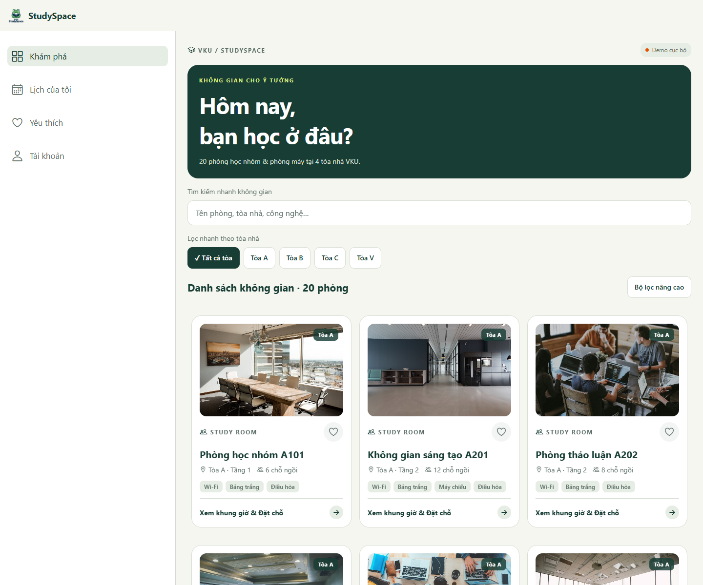

StudySpace giúp sinh viên chọn một không gian phù hợp, xem khung giờ trống, đặt phòng và quản lý buổi học trong cùng một ứng dụng. Dự án dùng chung mã nguồn cho điện thoại và web, có chế độ demo chạy không cần tài khoản cloud và chế độ Firebase để xác thực, đồng bộ dữ liệu.

**Dữ liệu mẫu:** 20 phòng tại 4 tòa A, B, C, V; gồm phòng học nhóm và phòng máy. Tên phòng, mô tả và ảnh trong bộ demo phục vụ minh họa, chưa phải danh mục phòng được VKU xác nhận.

**Mục lục:** [Sản phẩm](#san-pham) · [Ảnh màn hình](#anh-man-hinh) · [Nghiệp vụ](#nghiep-vu) · [Kỹ thuật](#ky-thuat) · [Dữ liệu](#du-lieu) · [Cài đặt](#cai-dat) · [Firebase](#firebase) · [Build](#build) · [Kiểm thử](#kiem-thu) · [Demo](#demo) · [Giới hạn](#gioi-han)

## 1. Sản phẩm và tính năng

### Bài toán

Sinh viên cần biết phòng nào phù hợp với quy mô nhóm, có thiết bị gì và còn trống lúc nào. StudySpace cung cấp danh sách tập trung, lọc theo nhu cầu và một quy trình đặt phòng có bước kiểm tra trước khi xác nhận.

| Nhóm chức năng | Người dùng có thể làm gì? |
| --- | --- |
| Tài khoản | Đăng ký, đăng nhập bằng email/mật khẩu với Firebase; đăng nhập Google trên môi trường hỗ trợ; đăng xuất. |
| Khám phá | Xem phòng học nhóm/phòng máy, tên phòng, tòa, tầng, sức chứa và tiện nghi. |
| Tìm kiếm | Tìm không dấu theo tên, tòa, mô tả và thiết bị; ví dụ `phong hoc` hoặc `may chieu`. |
| Bộ lọc | Kết hợp tòa nhà, số chỗ ngồi tối thiểu và nhiều tiện nghi theo điều kiện AND; xóa lọc khi cần. |
| Ảnh phòng | Xem ảnh bìa, thumbnail và ảnh toàn màn hình; vuốt/chuyển ảnh khi phòng có nhiều ảnh. |
| Đặt phòng | Chọn ngày, khung giờ trống, kiểm tra thông tin, xác nhận và nhận vé QR. |
| Lịch của tôi | Xem lịch sắp tới, mở lại vé, xem lịch sử đã hủy/hoàn thành/đã kết thúc. |
| Check-in | Bấm xác nhận nhận phòng trong khoảng thời gian cho phép. |
| Trả phòng | Hủy trước giờ bắt đầu hoặc kết thúc sớm sau check-in; giải phóng khóa phòng. |
| Yêu thích | Thêm/bỏ phòng bằng biểu tượng tim, xem nhanh trong tab Yêu thích. |
| Nhắc lịch | Đặt thông báo cục bộ trước buổi học 15 phút trên điện thoại; bật/tắt trong Tài khoản. |
| Thử thông báo | Bấm **Thử thông báo sau 5 giây** trên điện thoại để kiểm tra quyền và hiển thị thông báo. |
| Kết nối | Hiển thị trạng thái tải, lỗi, thử lại, dữ liệu cũ, không có kết quả và mất mạng. |
| Đa nền tảng | Bottom tabs trên màn hình nhỏ; sidebar và danh sách nhiều cột trên desktop. |

### Hai chế độ dữ liệu

| | Demo cục bộ | Firebase |
| --- | --- | --- |
| Bật bằng | `EXPO_PUBLIC_BACKEND=demo` | `EXPO_PUBLIC_BACKEND=firebase` |
| Đăng nhập | Nhập email hợp lệ, không xác thực mật khẩu | Firebase Authentication |
| Danh mục phòng | `seedRooms` trong mã nguồn | Collection `rooms` |
| Lịch đặt | AsyncStorage trên thiết bị/trình duyệt | Firestore |
| Đồng bộ nhiều thiết bị | Không | Có, qua snapshot realtime |
| Chống tranh cùng phòng/giờ | Tuần tự trong một tiến trình JavaScript | Firestore transaction và khóa `roomSlots` |
| Mục đích | Trải nghiệm giao diện, quay demo, phát triển cục bộ | Thử nghiệm nhiều người dùng và tích hợp backend |

> Một số quy tắc trong giao diện là yêu cầu sản phẩm, chưa được thực thi đầy đủ trong adapter Firebase hiện tại. Xem [bảng quy tắc](#quy-tac) và [giới hạn triển khai](#gioi-han) trước khi đánh giá tính đúng của backend.

## 2. Ảnh màn hình sản phẩm

Ảnh chụp trực tiếp từ app đang chạy ngày **25/09/2026**, bằng bản React Native Web ở chế độ demo. Ảnh dọc dùng viewport **430 × 932**; ảnh desktop dùng **1440 × 1200**. Đây là giao diện thật của mã nguồn hiện tại, không phải bản thiết kế dựng sẵn. Ảnh phòng bên trong app là ảnh minh họa từ các URL Unsplash trong dữ liệu mẫu.

<table>
  <tr>
    <th>Đăng nhập demo</th>
    <th>Khám phá không gian</th>
    <th>Chi tiết phòng</th>
  </tr>
  <tr>
    <td>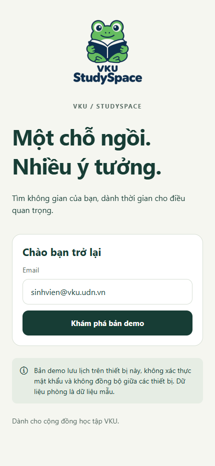</td>
    <td>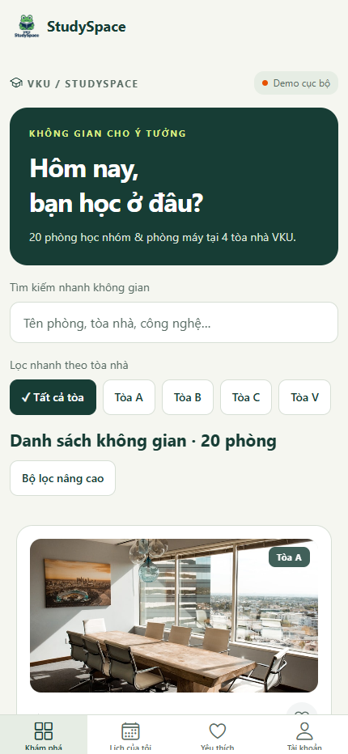</td>
    <td>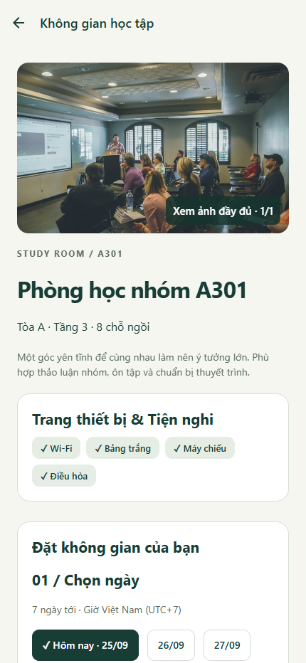</td>
  </tr>
  <tr>
    <th>Chọn ngày và khung giờ</th>
    <th>Kiểm tra trước khi đặt</th>
    <th>Vé đặt phòng QR</th>
  </tr>
  <tr>
    <td>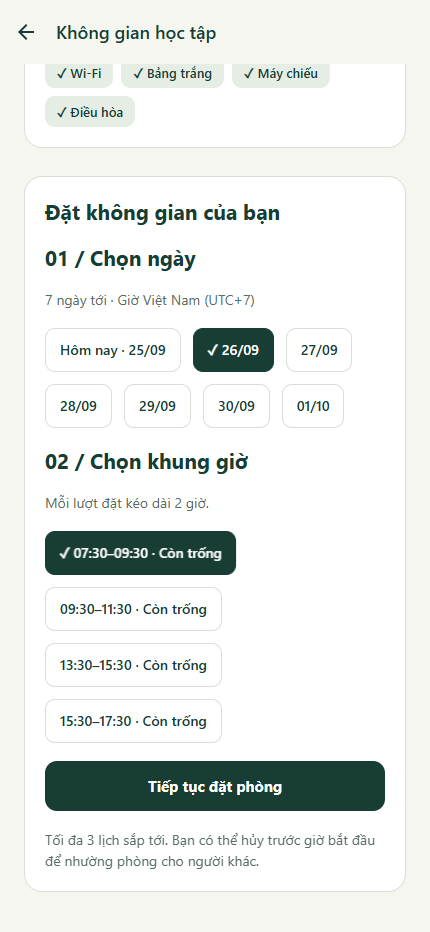</td>
    <td>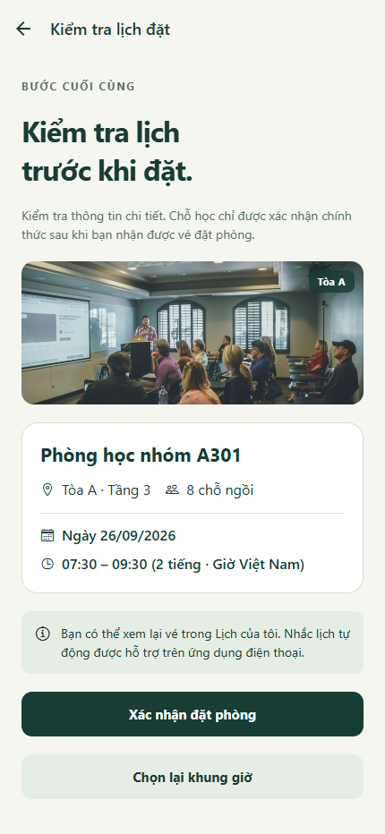</td>
    <td>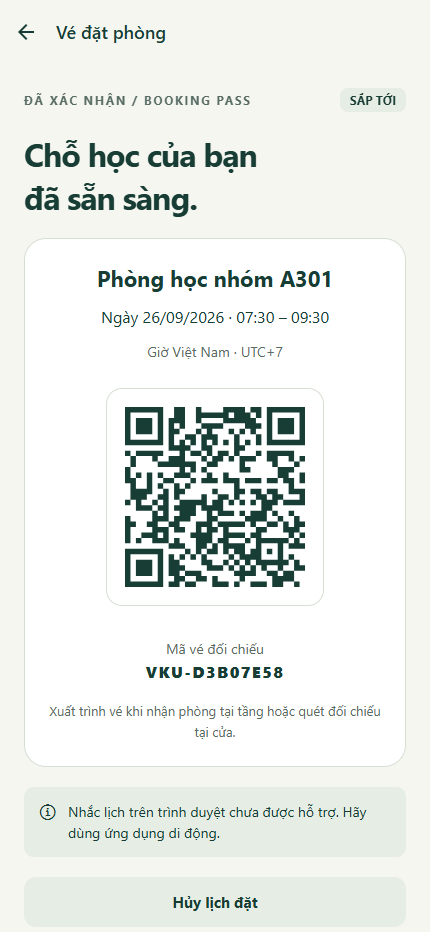</td>
  </tr>
  <tr>
    <th>Lịch sắp tới</th>
    <th>Phòng yêu thích</th>
    <th>Tài khoản và nhắc lịch</th>
  </tr>
  <tr>
    <td>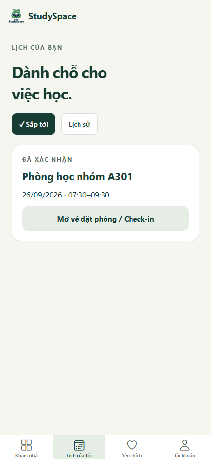</td>
    <td>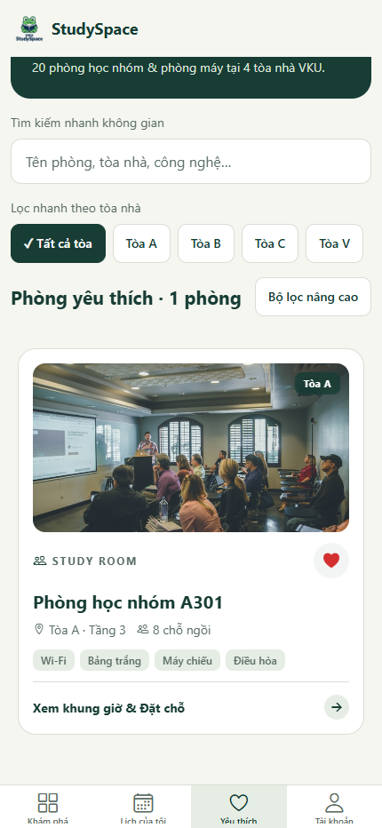</td>
    <td>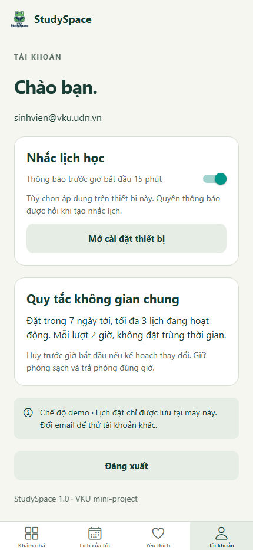</td>
  </tr>
</table>

<strong>Xem thêm: bộ lọc nâng cao và lịch sử sau khi hủy</strong>

<table>
  <tr><th>Lọc sức chứa và tiện nghi</th><th>Lịch sử đã hủy</th></tr>
  <tr>
    <td>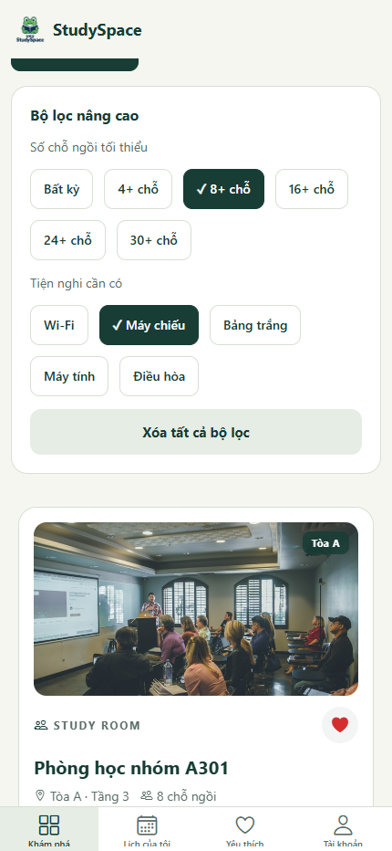</td>
    <td>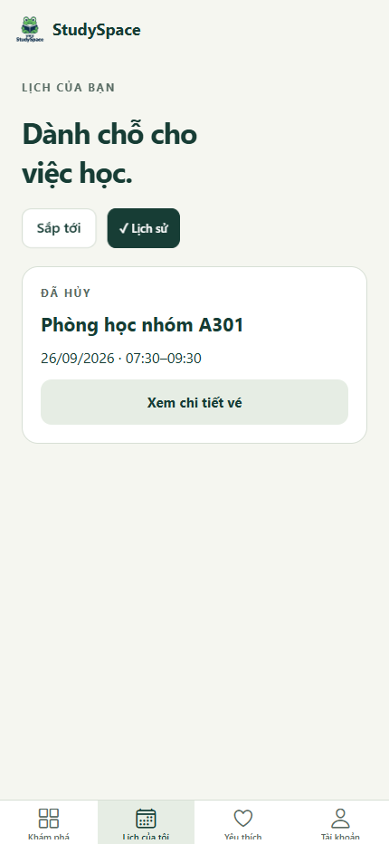</td>
  </tr>
</table>

Ảnh tài khoản là bản web nên không có nút thử thông báo dành riêng cho điện thoại. Bộ ảnh này chưa chứng minh hoạt động của thông báo hệ điều hành, Google Sign-In native hay check-in trên thiết bị thật. Thông tin từng ảnh nằm trong [hồ sơ chụp màn hình](docs/screenshots/README.md).

## 3. Luồng nghiệp vụ

### Từ tìm phòng đến nhận vé

~~~mermaid
flowchart LR
    A["Đăng nhập"] --> B["Khám phá / Yêu thích"]
    B --> C["Tìm kiếm và lọc"]
    C --> D["Chi tiết phòng"]
    D --> E["Chọn ngày và giờ"]
    E --> F["Kiểm tra lịch đặt"]
    F --> G{"Xác nhận thành công?"}
    G -->|Có| H["Vé QR + Lịch của tôi"]
    G -->|Xung đột / lỗi| E
    H --> I["Nhắc lịch trên điện thoại"]
    H --> J["Hủy / Check-in / Trả sớm"]
~~~

1. Người dùng đăng nhập và tìm phòng bằng từ khóa hoặc bộ lọc.
2. Màn chi tiết theo dõi tình trạng phòng theo ngày. Slot đã qua hoặc đã có người đặt bị vô hiệu hóa.
3. Người dùng chọn slot và xem lại phòng, ngày, giờ tại màn **Kiểm tra lịch đặt**.
4. Khi xác nhận, repository ghi lịch và khóa slot. Chỉ sau khi thao tác thành công, app mới chuyển sang vé.
5. Vé có QR chứa `{ v: 1, token }` và mã đối chiếu. Payload không chứa email/tên; hiện chưa có trình quét xác thực vé.
6. Lịch được hiển thị trong **Lịch của tôi** và có thể hủy, check-in hoặc trả phòng sớm tùy trạng thái.

### Vòng đời lịch đặt

~~~mermaid
stateDiagram-v2
    [*] --> CONFIRMED: Đặt thành công
    CONFIRMED --> CANCELLED: Hủy trước giờ bắt đầu
    CONFIRMED --> CHECKED_IN: Check-in trong thời gian cho phép
    CHECKED_IN --> COMPLETED: Kết thúc và trả phòng sớm
    CANCELLED --> [*]
    COMPLETED --> [*]
~~~

Sơ đồ thể hiện luồng người dùng qua giao diện. Khi đã qua `endAt`, app đưa lịch vào lịch sử theo thời gian; hiện chưa có tác vụ nền tự chuyển mọi lịch hết giờ sang `COMPLETED`.

- **Hủy:** cần xác nhận lại; đổi trạng thái và giải phóng khóa trong cùng transaction.
- **Check-in:** nút hiện từ 15 phút trước `startAt` đến `endAt`; đây là thao tác tự xác nhận trong app.
- **Trả sớm:** giao diện chỉ hiện sau khi check-in; lịch chuyển thành `COMPLETED`.
- **Đặt lại sau khi giải phóng:** vẫn phải thỏa điều kiện slot chưa bắt đầu. Trả phòng khi slot đã bắt đầu không mở thêm một lượt đặt giữa slot.

### Quy tắc và mức độ thực thi hiện tại

| Quy tắc | Triển khai hiện tại |
| --- | --- |
| Giờ Việt Nam, UTC+7 | `campusDate` và `slotTimes` trong domain dùng UTC+7. |
| Đặt hôm nay và 6 ngày tiếp theo | Màn chọn ngày và adapter demo kiểm tra; Firebase adapter chưa kiểm tra lại đầy đủ giới hạn 7 ngày. |
| Mỗi lượt 2 giờ | 4 slot cố định: **07:30–09:30**, **09:30–11:30**, **13:30–15:30**, **15:30–17:30**. |
| Chỉ phòng đang hoạt động được đặt | Lọc phòng active; transaction đọc lại trạng thái phòng; rules kiểm tra active khi tạo. |
| Không đặt slot đã bắt đầu | Giao diện và adapter kiểm tra thời gian; rules chưa ràng buộc đầy đủ với giờ server. |
| Không đặt trùng cùng phòng/ngày/slot | Adapter Firebase dùng một khóa xác định và transaction. |
| Tối đa 3 lịch đang hoạt động | Adapter demo kiểm tra; Firebase adapter hiện chưa thực thi giới hạn này. |
| Không trùng giờ giữa hai phòng của cùng người | Adapter demo kiểm tra; Firebase adapter hiện chưa thực thi kiểm tra này. |
| Hủy trước giờ bắt đầu | Giao diện và adapter kiểm tra; rules kiểm soát chủ sở hữu và chuyển trạng thái nhưng chưa kiểm tra đầy đủ mốc giờ. |
| Không đặt/hủy khi offline | UI chặn thao tác; không có hàng đợi tự gửi booking sau khi có mạng. |

### Nhắc lịch và quay demo thông báo

- Lịch đã xác nhận được đặt thông báo **trước giờ bắt đầu 15 phút** nếu còn đủ thời gian và có quyền.
- Từ chối quyền thông báo không làm mất lịch đặt.
- Tắt nhắc lịch, hủy lịch hoặc đăng xuất sẽ yêu cầu xóa các nhắc tương ứng trên thiết bị.
- Nút **Tài khoản → Nhắc lịch học → Thử thông báo sau 5 giây** tạo thông báo thử cục bộ, không cần tạo booking.
- Cần bật công tắc nhắc lịch để dùng nút thử. Web không hỗ trợ luồng thông báo này.
- Thông báo thử kiểm tra cơ chế hiển thị; việc giao thông báo đúng giờ khi app ở nền vẫn cần thử trên điện thoại.

## 4. Công nghệ và kiến trúc

### Stack

Phiên bản dưới đây lấy từ cấu hình dự án, không phải tuyên bố về phiên bản mới nhất của thư viện.

| Thành phần | Công nghệ | Vai trò |
| --- | --- | --- |
| Ứng dụng | React 19.2.3, React Native 0.86.3, Expo ~57.0.24 | Chia sẻ code Android/iOS/web |
| Ngôn ngữ | TypeScript ~6.0.3, `strict: true` | Kiểu dữ liệu và kiểm tra tĩnh |
| Điều hướng | React Navigation 7, Native Stack, Bottom Tabs | Màn hình, tab, tham số route |
| Dữ liệu và cache | TanStack Query 5 | Snapshot, loading/error, mutation |
| State giao diện | Zustand 5 | Bộ lọc, yêu thích, nhắc lịch, bản nháp |
| Lưu trên thiết bị | AsyncStorage 2 | Preferences, cache và lịch demo |
| Backend đang dùng | Firebase JS SDK 12, Authentication, Firestore | Xác thực, realtime, transaction |
| Thông báo | Expo Notifications | Nhắc cục bộ và thông báo thử |
| Tương tác | Reanimated 4, Gesture Handler 2 | Animation, chuyển trạng thái, gesture root |
| QR | react-native-qrcode-svg, react-native-svg | Render mã vé |
| Kết nối | NetInfo | Theo dõi online/offline |
| Kiểm thử | Vitest 5, Firebase Emulator Suite | Domain, adapter, rules và concurrency |
| Backend bổ sung trong repo | Cloud Functions for Firebase, Admin SDK, Node 22 | Callable implementation riêng; chưa nối vào adapter app hiện tại |

### Kiến trúc đang chạy

~~~mermaid
flowchart TD
    UI["React Native / React Native Web"] --> NAV["React Navigation"]
    NAV --> SCREENS["Auth · Rooms · Bookings · Account"]
    SCREENS --> APP["AppProvider + Repository interface"]
    SCREENS --> STATE["Zustand preferences / draft"]
    STATE --> LOCAL["AsyncStorage"]
    APP --> QUERY["TanStack Query + useRealtimeQuery"]
    APP --> DEMO["Demo repository"]
    APP --> FIREBASE["Firebase repository"]
    DEMO --> LOCAL
    FIREBASE --> AUTH["Firebase Authentication"]
    FIREBASE --> DB["Firestore snapshots + transactions"]
    DB --> RULES["Security Rules"]
    SCREENS --> NOTIFY["Expo Notifications · native"]
~~~

**Phân tách trách nhiệm**

- `src/features` chứa màn hình và hành vi tương tác.
- `src/services/repository.ts` định nghĩa hợp đồng dữ liệu; UI gọi interface thay vì gọi Firestore trực tiếp.
- `src/domain` chứa model, slot, quy tắc, tìm kiếm/lọc và dữ liệu mẫu.
- `useRealtimeQuery` dùng snapshot đầu làm kết quả Query, sau đó duy trì subscription để cập nhật cache; listener được dọn khi đổi query/unmount.
- Cache phòng phân vùng theo backend; cache booking có thêm UID. Cache cũ được đánh dấu stale.
- Zustand lưu bộ lọc, yêu thích, nhắc lịch và draft. Draft được khôi phục khi còn hợp lệ trong 24 giờ; xác nhận thành công sẽ xóa draft.
- Preferences và draft hiện được lưu theo thiết bị, **chưa phân vùng theo tài khoản**.
- Firebase adapter có ghi yêu thích lên `users/{uid}/favorites`, nhưng UI hiện chưa đọc lại collection này để đồng bộ yêu thích giữa các máy.

### Transaction đặt phòng

Adapter hiện tại ở [src/services/firebase.ts](src/services/firebase.ts) dùng `runTransaction`:

1. Lấy UID từ Firebase Auth.
2. Tạo ID booking: `{uid}__{idempotencyKey}`.
3. Nếu booking đã tồn tại và intent trùng khớp, trả lại booking đó để tránh ghi lặp.
4. Đọc `roomSlots/{roomId}__{date}__{slotId}`; từ chối nếu đã có khóa.
5. Đọc phòng và kiểm tra active, thời gian bắt đầu.
6. Ghi booking và khóa slot atomically; snapshot realtime cập nhật giao diện.

Khi hủy/trả sớm, transaction cập nhật trạng thái và chỉ xóa khóa đang thuộc booking đó.

**Cloud Functions trong repo là một đường xử lý khác:** `createBooking`/`cancelBooking` dùng `slotLocks`, ID SHA-256, `userGuards` và `bookingEvents`. App hiện không gọi các callable này. Không xem việc deploy Functions là đã chuyển app sang kiểm tra nghiệp vụ hoàn toàn ở server; hai đường xử lý cần được thống nhất trước khi sử dụng chung. Chi tiết trong [tài liệu kiến trúc](docs/architecture.md).

### Điều hướng

| Màn hình | Route web |
| --- | --- |
| Khám phá | `/` |
| Lịch của tôi | `/bookings` |
| Yêu thích | `/favorites` |
| Tài khoản | `/account` |
| Chi tiết phòng | `/rooms/:roomId` |
| Kiểm tra lịch | `/review/:roomId/:date/:slotId/:idempotencyKey` |
| Vé đặt phòng | `/bookings/:bookingId` |

Scheme native: `studyspace://`. Đường dẫn cần phiên đăng nhập phù hợp; cấu hình route không thay thế kiểm tra quyền dữ liệu.

## 5. Mô hình dữ liệu và quyền truy cập

### Các collection trong luồng app hiện tại

| Collection | Dữ liệu chính | Quyền trong rules của repo |
| --- | --- | --- |
| `rooms/{roomId}` | Tên, tòa, tầng, sức chứa, loại phòng, thiết bị, active, ảnh | Tài khoản đã đăng nhập đọc; client không ghi |
| `bookings/{bookingId}` | Chủ lịch, phòng, ngày/slot, start/end, trạng thái, token, timestamps | Chủ lịch đọc; create/update theo schema và chuyển trạng thái hợp lệ; không xóa |
| `roomSlots/{slotKey}` | Phòng, ngày, slot, bookingId, createdAt | Người đăng nhập đọc; tạo/xóa đi cùng booking; không update |
| `users/{uid}/favorites/{roomId}` | roomId, addedAt | Chỉ chủ tài khoản đọc/ghi |
| `userGuards`, `bookingEvents` | Guard/audit của callable implementation | Client không đọc/ghi |
| `slotLocks` | Khóa của callable implementation | Không nằm trong luồng app; client bị chặn bởi rules mặc định |

### Model rút gọn

~~~ts
type Room = {
  id: string;
  name: string;
  building: string;
  floor: number;
  capacity: number;
  kind: "study" | "lab";
  equipment: Equipment[];
  description: string;
  active: boolean;
  imageUrl?: string;
  imageUrls?: string[];
  imagesAreIllustrative?: boolean;
};

type BookingStatus =
  | "CONFIRMED"
  | "CHECKED_IN"
  | "CANCELLED"
  | "COMPLETED";

// Booking còn lưu userId, roomId, roomName, date, slotId,
// startAt, endAt, passToken, createdAt và các mốc chuyển trạng thái.
~~~

Rules kiểm tra chủ sở hữu, tập trường được phép, tính bất biến của thông tin vé và quan hệ booking–slot qua `getAfter`/`existsAfter`. Tuy nhiên, rules chưa xác thực đầy đủ `date/slotId` khớp với `startAt/endAt`, thời điểm thao tác theo giờ server, số lịch tối đa và overlap. Những phần này cần hoàn thiện trước khi nhận dữ liệu từ client không đáng tin cậy.

## 6. Cài đặt và chạy cục bộ

### Yêu cầu

- **Node.js 22.13+ trong nhánh 22** và npm; CI dùng Node 22.
- Điện thoại có Expo Go tương thích SDK 57 nếu thử bằng Expo Go.
- Android Studio/Android SDK và JDK phù hợp nếu build Android tại máy.
- macOS và Xcode nếu build iOS tại máy.
- **JDK 21+** cho Firebase Emulator theo cấu hình kiểm thử của dự án.

### Chạy demo nhanh

Tại thư mục gốc dự án:

~~~sh
npm ci
~~~

Copy `.env.example` thành `.env` nếu chưa có, rồi đặt:

~~~dotenv
EXPO_PUBLIC_BACKEND=demo
EXPO_PUBLIC_USE_EMULATORS=false
~~~

Chọn cách chạy:

~~~sh
# Trình duyệt
npm run web

# Điện thoại qua Expo Go
npx expo start --go --lan
~~~

Trên màn đăng nhập demo, dùng `sinhvien@vku.udn.vn` hoặc một email hợp lệ bất kỳ. Không cần mật khẩu trong chế độ này.

Nếu máy đang có `.env` Firebase và chỉ muốn mở một phiên demo riêng trên Windows PowerShell:

~~~powershell
$env:EXPO_PUBLIC_BACKEND = 'demo'
$env:EXPO_NO_DOTENV = '1'
npx expo start --web --localhost --port 8083
~~~

Hai biến trên chỉ áp dụng cho phiên terminal đó. Đóng terminal demo trước khi mở terminal mới để chạy Firebase.

### Điện thoại ở mạng khác

~~~sh
npx expo start --go --tunnel
~~~

Quét QR bằng Expo Go. Tunnel cần máy chạy Metro còn bật và có Internet; link có thể đổi khi khởi động lại. Nó không thay thế một bản cài đặt độc lập. Dự án đã khai báo `@expo/ngrok` trong devDependencies.

### Development build

Google Sign-In native cần development build, vì Expo Go không có module native của dự án.

~~~sh
npm run android
# Sau khi đã cài bản development:
npm run start:dev-client
~~~

`npm run android` yêu cầu bộ công cụ Android tại máy. File `artifacts/StudySpace-development-arm64.apk` nếu có là artifact cục bộ, bị Git ignore và không được bảo đảm có trong một bản clone mới.

## 7. Cấu hình Firebase

### Xác thực và biến môi trường

Tạo/chọn Firebase project development, đăng ký web app và bật Email/Password. Bật Google provider nếu cần. Điền public client config vào `.env`:

~~~dotenv
EXPO_PUBLIC_BACKEND=firebase
EXPO_PUBLIC_FIREBASE_API_KEY=YOUR_WEB_API_KEY
EXPO_PUBLIC_FIREBASE_AUTH_DOMAIN=YOUR_PROJECT.firebaseapp.com
EXPO_PUBLIC_FIREBASE_PROJECT_ID=YOUR_PROJECT_ID
EXPO_PUBLIC_FIREBASE_APP_ID=YOUR_WEB_APP_ID
EXPO_PUBLIC_GOOGLE_WEB_CLIENT_ID=YOUR_WEB_OAUTH_CLIENT_ID
EXPO_PUBLIC_USE_EMULATORS=false
~~~

Các biến `EXPO_PUBLIC_*` sẽ được đưa vào app. Không đặt private key/service-account JSON trong những biến này. `.env` được Git ignore; chỉ `.env.example` được theo dõi.

Để đăng nhập Google native, cấu hình đúng package/bundle ID, chữ ký Android và thay `google-services.json`/`GoogleService-Info.plist` bằng file của project bạn. Build lại sau khi đổi cấu hình native. Trên web, thêm domain đang sử dụng vào Authorized domains của Firebase Auth.

Nút **Điền nhanh tài khoản mẫu VKU** chỉ điền form; nó không tự tạo tài khoản Firebase.

### Firestore rules và indexes

~~~sh
npx firebase login
npx firebase deploy --project YOUR_DEV_PROJECT --only firestore
~~~

App hiện sử dụng trực tiếp Firestore; không cần deploy callable Functions để chạy adapter hiện tại. `firebase.json` đang khai báo Firestore location `asia-northeast1`; callable Functions trong repo dùng region `asia-southeast1`.

### Nạp dữ liệu mẫu bằng Admin SDK

Rules chặn client ghi `rooms`, vì vậy dùng seed Admin SDK sau:

~~~sh
npm ci --prefix firebase/functions
~~~

PowerShell, với Application Default Credentials đã được cấu hình cho project development:

~~~powershell
$env:GCLOUD_PROJECT = 'YOUR_DEV_PROJECT'
$env:ALLOW_REMOTE_SEED = 'true'
npm --prefix firebase/functions run seed
~~~

Seed ghi đè các document của **20 phòng mẫu**, bao gồm những trường ảnh đang có. Chỉ dùng trên dữ liệu development có thể thay thế. Cách cấu hình credentials: [Firebase Admin SDK](https://firebase.google.com/docs/admin/setup).

`npm run seed` ở thư mục gốc gọi một script dùng client SDK, nên sẽ bị rules hiện tại từ chối ghi phòng; không dùng lệnh này làm bước cài đặt mặc định.

Để thêm nhiều ảnh cho từng phòng, xem [hướng dẫn bộ ảnh phòng](docs/room-photos.md). App ưu tiên `imageUrls`, loại URL trùng và dùng `imageUrl` làm ảnh dự phòng khi cần.

### Chạy với Emulator

Terminal 1:

~~~sh
npx firebase emulators:start --project demo-studyspace --only auth,firestore
~~~

Cấu hình app:

~~~dotenv
EXPO_PUBLIC_BACKEND=firebase
EXPO_PUBLIC_FIREBASE_API_KEY=demo-key
EXPO_PUBLIC_FIREBASE_AUTH_DOMAIN=demo-studyspace.firebaseapp.com
EXPO_PUBLIC_FIREBASE_PROJECT_ID=demo-studyspace
EXPO_PUBLIC_FIREBASE_APP_ID=demo-app
EXPO_PUBLIC_USE_EMULATORS=true
EXPO_PUBLIC_EMULATOR_HOST=127.0.0.1
~~~

Terminal 2, seed vào emulator:

~~~powershell
$env:GCLOUD_PROJECT = 'demo-studyspace'
$env:FIRESTORE_EMULATOR_HOST = '127.0.0.1:8080'
npm --prefix firebase/functions run seed
~~~

Khởi động lại Metro sau khi sửa môi trường. Với điện thoại thật, thay `127.0.0.1` bằng IP LAN của máy chạy emulator và cấu hình emulator lắng nghe trên địa chỉ mà điện thoại truy cập được. Cổng mặc định trong repo: Auth `9099`, Firestore `8080`, Functions `5001`.

## 8. Build và phân phối

| Cách chạy/build | Có cần Metro? | Ghi chú |
| --- | --- | --- |
| Expo Go qua LAN/tunnel | Có | Phù hợp phát triển; Google native bị vô hiệu |
| Development build | Có khi chạy luồng phát triển | Có module native của app |
| EAS `preview` Android APK | Không | Profile trong `eas.json` đặt `buildType: apk` |
| EAS `production` | Không | Profile phát hành; cần cấu hình tài khoản/chữ ký/môi trường |
| Web export | Không sau khi đã host | Tạo thư mục `dist` |

### Android APK bằng EAS

Sau khi đăng nhập Expo và liên kết/cấu hình EAS project:

~~~sh
npx eas-cli login
npx eas-cli build:configure
npx eas-cli build --platform android --profile preview
~~~

Cấu hình các biến Firebase cho môi trường build nếu cần backend thật; không giả định `.env` cục bộ sẽ có trên cloud builder. Profile `preview` đã có trong repo; việc có profile chưa có nghĩa là đã có bản build được phát hành. Tham khảo [hướng dẫn APK của Expo](https://docs.expo.dev/build-reference/apk/).

### Web

~~~sh
npm run build:web
~~~

Host nội dung `dist` bằng static hosting có SPA fallback về `index.html` để mở/refresh đường dẫn phòng và vé. Repo chưa có cấu hình Firebase Hosting; cần thêm cấu hình hosting trước khi deploy web.

### CI

- [.github/workflows/ci.yml](.github/workflows/ci.yml): typecheck, unit tests, Functions build, emulator tests và web export.
- [.github/workflows/build-apk.yml](.github/workflows/build-apk.yml): prebuild Android, Gradle release APK, upload artifact và gắn vào GitHub Release `v1.0.0` khi chạy workflow.

Workflow có trong repo không đồng nghĩa lần chạy gần nhất đã thành công. Cần kiểm tra môi trường Firebase, chữ ký và kết quả build trước khi chia sẻ APK.

## 9. Kiểm thử và kết quả kiểm tra

| Lệnh | Mục đích |
| --- | --- |
| `npm run typecheck` | TypeScript app |
| `npm run test:unit` | Domain, demo, reminder, roomPhotos, query adapter |
| `npm test` | Toàn bộ Vitest; integration tự bỏ qua nếu không có emulator |
| `npm run build:server` | Build Cloud Functions |
| `npm run test:emulators` | Khởi động Auth/Firestore/Functions emulator và chạy integration |
| `npm run build:web` | Export web bundle |
| `npx expo install --check` | Kiểm tra phiên bản package phù hợp Expo SDK |

**Kiểm tra trong lần cập nhật README ngày 25/09/2026:**

| Phạm vi | Kết quả |
| --- | --- |
| TypeScript | Đạt |
| Unit tests | **23/23**, thuộc 5 file |
| Demo trên browser | Đăng nhập, tìm không dấu, lọc, mở phòng, chọn giờ, tạo vé, mở lại vé, hủy, lịch sử và yêu thích chạy được |
| Console của browser | Không ghi nhận page error; có cảnh báo deprecation `pointerEvents` từ runtime |
| Ảnh minh họa README | Chụp từ phiên app thật; 12 PNG, đã kiểm tra trực quan |
| Emulator / EAS / native notification | Không chạy lại trong lượt cập nhật tài liệu này |

Các integration test hiện bao gồm callable Functions và một số thao tác trực tiếp theo rules. Kết quả của chúng không tự chứng minh toàn bộ adapter Firebase trên điện thoại đã được kiểm thử từ đầu đến cuối. Báo cáo kiểm tra cũ có ngày cụ thể trong [docs/verification.md](docs/verification.md).

## 10. Quay video demo

Luồng ngắn để giới thiệu sản phẩm:

**Đăng nhập → tìm/lọc → xem ảnh phòng → chọn ngày/giờ → xác nhận → vé QR → lịch sắp tới → thông báo thử → hủy → lịch sử → yêu thích → tài khoản/đăng xuất.**

[Kịch bản thao tác đầy đủ](docs/demo-script.md) có mốc thời gian cho video khoảng 3–4 phút và các cảnh ghép thêm: check-in/trả sớm, hai tài khoản tranh slot, offline, Google Sign-In và web.

Để quay check-in, chuẩn bị một lịch riêng rồi mở vé từ 15 phút trước giờ bắt đầu. Để quay thông báo, dùng nút thử sau 5 giây trên điện thoại. Chưa có video được đính kèm trong repo; ảnh demo hiện có nằm ở `docs/screenshots`.

## 11. Cấu trúc thư mục

~~~text
room-booking-app/
├── App.tsx                    # Root providers, navigation, error boundary
├── index.ts                   # Expo entry point
├── app.json                   # Expo / native plugins / identifiers
├── eas.json                   # Development, preview, production profiles
├── src/
│   ├── app/                   # AppProvider, route types, linking
│   ├── components/            # UI, RoomCard image, gallery
│   ├── domain/                # Models, slots, policy, room seed
│   ├── features/
│   │   ├── auth/              # Login / registration / Google
│   │   ├── rooms/             # Feed, RoomCard, Detail
│   │   ├── bookings/          # Review, Pass, Bookings
│   │   └── account/           # Preferences, notifications, logout
│   ├── hooks/                 # Realtime query, gallery keyboard support
│   ├── services/              # Repository adapters, auth, reminders
│   └── stores/                # Zustand preferences và draft
├── firebase/
│   ├── firestore.rules
│   ├── firestore.indexes.json
│   └── functions/             # Callable implementation và Admin seed
├── scripts/                   # Seed, ảnh phòng, emulator runner
├── tests/                     # Unit và integration
├── docs/                      # Nghiệp vụ, kiến trúc, demo, kiểm chứng
│   └── screenshots/           # Ảnh chụp sản phẩm được dùng trong README
├── design-system/             # Hướng dẫn giao diện
└── .github/workflows/         # CI và Android release workflow
~~~

## 12. Giới hạn và hướng phát triển

- Thống nhất đường ghi booking của app và Cloud Functions; hiện hai đường sử dụng collection khóa khác nhau.
- Thực thi giới hạn 7 ngày, tối đa 3 lịch, chống overlap và kiểm tra thời gian bằng nguồn tin cậy ở backend.
- Hoàn thiện đồng bộ yêu thích và phân vùng preferences/draft theo tài khoản.
- Bổ sung scanner/verifier QR, quyền quản trị phòng, khóa phòng bảo trì và xử lý no-show.
- Bổ sung email verification, chính sách tài khoản campus, App Check và giới hạn tần suất nếu đưa vào sử dụng thật.
- Chưa có remote push, tác vụ tự hoàn tất lịch, lịch lặp, danh sách chờ, xuất lịch hoặc deep link khi chạm notification.
- Cần kiểm tra trên Android/iOS thật cho notification, quyền hệ điều hành, accessibility và hiệu năng danh sách lớn.

## 13. Tài liệu liên quan

| Tài liệu | Nội dung |
| --- | --- |
| [PRD](docs/PRD.md) | Yêu cầu và tiêu chí ban đầu; không phải mọi mục đều đã thực thi |
| [Kiến trúc](docs/architecture.md) | Adapter đang chạy, transaction, state và khác biệt với callable |
| [Kịch bản demo](docs/demo-script.md) | Thứ tự thao tác quay video |
| [Hồ sơ ảnh](docs/screenshots/README.md) | Nguồn ảnh, môi trường chụp và danh sách màn hình |
| [Ảnh phòng](docs/room-photos.md) | Cấu hình gallery bằng `imageUrls` |
| [Báo cáo kiểm tra trước đây](docs/verification.md) | Kết quả theo mốc thời gian được ghi trong tài liệu |
| [Rubric](docs/RUBRIC.md) | Đối chiếu hạng mục môn học |
| [Design system](design-system/studyspace/MASTER.md) | Quy ước giao diện |
