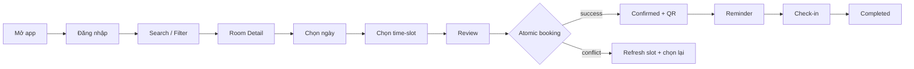
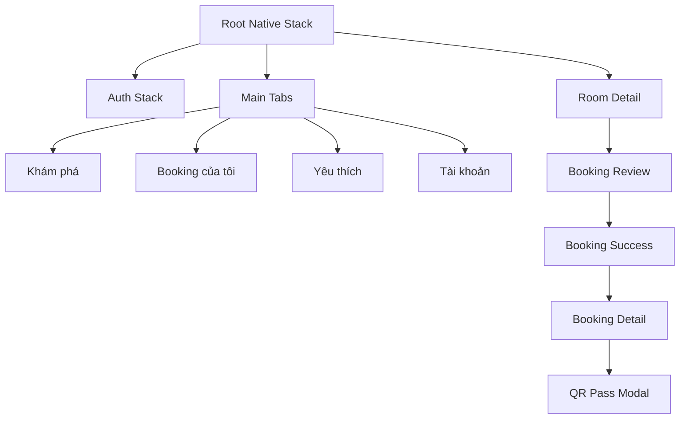
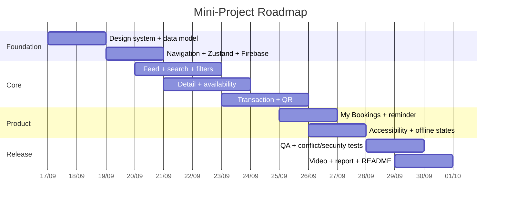

# PRD — Real-time Campus Study Room & Computer Lab Booking App

## Executive Summary

**Bản PRD Markdown hoàn chỉnh, sẵn sàng đưa vào repository:**  
[**Tải `PRD_VKU_StudySpace_Room_Booking.md`**](sandbox:/mnt/data/PRD_VKU_StudySpace_Room_Booking.md)

PRD được xây dựng từ yêu cầu gốc của Mini-Project 2 nhưng nâng phạm vi từ một demo đặt phòng thành một **room-booking product có thể triển khai thực tế**. P0 vẫn giữ nguyên các yêu cầu bắt buộc: React Native + Expo + TypeScript, `FlatList` hướng tới 60fps, search và multi-parameter filters, bộ chọn 7 ngày với time-slot 2 giờ, realtime conflict prevention, QR booking pass, Zustand, AsyncStorage và thông báo trước 15 phút. Phần mở rộng tập trung vào những thứ mà một hệ thống đặt phòng thực tế cần có nhưng đề bài chưa nói rõ: authentication, booking lifecycle, cancellation, check-in/no-show, maintenance blackout, favorites, notification preferences, offline/stale-data behavior, role-based access, server-side conflict protection, accessibility, audit log, testing và deployment.

**Kiến trúc được khuyến nghị cho dự án này là Firebase Authentication + Cloud Firestore + Cloud Functions + Firebase Storage + Expo Notifications.** Expo chính thức hỗ trợ Firebase JS SDK với Authentication, Firestore, Realtime Database và Storage trong React Native; Firestore có realtime listeners và atomic transactions, phù hợp trực tiếp với hai bài toán quan trọng nhất của app là cập nhật availability và chống double-booking. citeturn19view3turn23view0turn23view1

Điểm thiết kế quan trọng nhất trong PRD là: **booking correctness > realtime clarity > usability > visual polish**. Không được coi slot là đã đặt chỉ vì client vừa bấm “Xác nhận”; booking chỉ chuyển sang `CONFIRMED` sau khi backend transaction thành công. Firestore transactions là atomic, tự retry khi document đã đọc bị thay đổi đồng thời và không áp dụng một phần các write; tài liệu Firebase cũng lưu ý client transaction sẽ thất bại khi offline. Vì vậy PRD không cho phép “offline booking rồi sync sau”, mà chỉ cho offline read/cache và giữ draft. citeturn23view1turn16view4

## Phạm vi sản phẩm và những tiện ích được bổ sung

Một ứng dụng room booking hoàn chỉnh không nên dừng ở chuỗi **“xem phòng → bấm đặt”**. Sản phẩm phải quản lý ba lớp dữ liệu cùng lúc: inventory của phòng, availability theo thời gian và toàn bộ vòng đời reservation. Vì vậy PRD tổ chức tính năng theo ba mức ưu tiên để tránh scope creep.

| Mức | Phạm vi |
|---|---|
| **P0 — bắt buộc để đạt yêu cầu project** | Login cơ bản; Room Feed; search; building/capacity/equipment filters; Room Detail; 7-day selector; discrete 2-hour slots; realtime availability; conflict prevention; create/cancel booking; My Bookings; QR pass; Zustand; AsyncStorage; reminder trước 15 phút; Stack + Bottom Tabs; loading/error/empty/offline states |
| **P1 — đưa app gần production** | Favorites; check-in; no-show; maintenance blackout; report equipment/room issue; remote push; notification deep-link; role student/staff/admin; calendar export; audit log; analytics |
| **P2 — mở rộng lâu dài** | Waitlist; recurring booking; map/floor navigation; campus SSO; web admin; occupancy sensor integration; recommendation; multi-campus |

PRD cũng đưa ra các **booking policy mặc định nhưng cấu hình được**, thay vì hard-code vào component: chỉ đặt trong 7 ngày tới, các slot theo cấu hình campus, giới hạn số booking tương lai mỗi user, check-in window trước/sau giờ bắt đầu, grace period cho no-show và rule ngăn một user sở hữu hai booking giao nhau. Những con số cụ thể trong file được đánh dấu là *product defaults đề xuất*, để có thể thay đổi mà không sửa UI.

Các persona không chỉ có một “student” chung chung mà gồm sinh viên học cá nhân, trưởng nhóm học, người cần computer lab với thiết bị cụ thể, staff kiểm tra booking và admin quản lý phòng. Nhờ vậy Room Detail được thiết kế để trả lời ngay năm câu hỏi: **phòng nào, ở đâu, chứa bao nhiêu người, có thiết bị gì và lúc nào thật sự còn trống**.

North-star journey trong PRD là:



Một mục tiêu UX được đặt ra là người dùng bình thường có thể đi từ mở Home đến nhận booking pass trong khoảng **≤45 giây** trong điều kiện mạng ổn định. Đây là KPI nội bộ được đề xuất cho sản phẩm, không phải một benchmark bên ngoài.

## Kiến trúc booking và realtime

PRD khuyến nghị **Cloud Firestore hơn Realtime Database** cho bản này. Tài liệu Firebase hiện khuyến nghị khách hàng mới bắt đầu với Cloud Firestore; Firestore hỗ trợ compound filtering, collections/documents, realtime/offline client capabilities và transaction trên nhiều document, trong khi Realtime Database phù hợp hơn với data model đơn giản và presence/state synchronization. citeturn23view2

Luồng realtime được giới hạn theo context thay vì subscribe toàn bộ booking của campus:

- Feed lấy room metadata và derived availability cần thiết.
- Room Detail subscribe availability theo `roomId + date`.
- My Bookings subscribe booking active của `userId`.
- Khi screen/query thay đổi, listener cũ phải unsubscribe.
- Client có `lastSyncedAt` và `stale` để người dùng biết dữ liệu cache không còn realtime.

Firestore `onSnapshot()` đưa snapshot ban đầu rồi gọi lại listener khi nội dung thay đổi, nên phù hợp với việc một thiết bị thấy slot chuyển từ `AVAILABLE` sang `BOOKED` ngay sau khi thiết bị khác đặt thành công. citeturn23view0

### Conflict engine

Điểm quan trọng nhất của data model là collection `slotLocks`. Vì đề bài dùng các khung giờ rời rạc, một lock có thể có ID deterministic:

```text
room_a301__2026-09-21__0730_0930
```

Khi user xác nhận booking, server thực hiện transaction:

```text
validate user
    ↓
validate room + slot + policy
    ↓
read slotLock
    ↓
┌──────────────────────┐
│ lock đã tồn tại?     │
└──────────────────────┘
      ↓ yes                 ↓ no
409 SLOT_ALREADY_BOOKED     create booking
                            create slotLock
                            create bookingEvent
                            commit atomically
```

Đây là thiết kế PRD đề xuất dựa trên transaction semantics của Firestore: các reads/writes trong transaction được xử lý atomically, transaction có thể được retry khi có concurrent modification và Firestore đảm bảo serializable isolation. citeturn23view1turn16view4

Ngoài `slotLock`, request tạo booking có `idempotencyKey`. Nếu user double-tap hoặc request timeout rồi retry, cùng một intent không được tạo booking thứ hai.

Canonical API trong file gồm:

| Method | Endpoint | Mục đích |
|---|---|---|
| `GET` | `/v1/rooms` | Search/filter rooms |
| `GET` | `/v1/rooms/:id` | Room detail |
| `GET` | `/v1/rooms/:id/availability` | Availability theo ngày |
| `POST` | `/v1/bookings` | Atomic booking |
| `GET` | `/v1/me/bookings` | Upcoming/history |
| `POST` | `/v1/bookings/:id/cancel` | Cancel + release lock |
| `POST` | `/v1/bookings/:id/check-in` | QR/check-in validation |
| `POST` | `/v1/devices/push-token` | Register push token |
| `POST` | `/v1/issues` | Report issue |
| `POST` | `/v1/admin/maintenance` | Maintenance blackout |

File `.md` có đầy đủ **sample JSON request/response**, bao gồm room query, availability response, successful booking và `409 SLOT_ALREADY_BOOKED`.

Về security, Firebase khuyến nghị mobile/web clients kết hợp Firebase Authentication với Cloud Firestore Security Rules; App Check có thể bổ sung lớp kiểm tra để giúp hạn chế truy cập database từ client không phải app hợp lệ. Security Rules cũng có thể kiểm tra authentication và validate incoming data. citeturn16view5turn16view6

Vì vậy PRD đặt ra nguyên tắc: client không được tự cấp `role=admin`, không được tự chuyển booking sang `CHECKED_IN`, và không được tùy ý tạo/sửa `slotLocks`. Những mutation nhạy cảm như create/cancel/check-in nên đi qua Cloud Function hoặc server endpoint.

Dữ liệu nhạy cảm do ứng dụng tự lưu không nên nằm cùng preferences/cache. Expo SecureStore cung cấp encrypted local key-value storage; do đó PRD dùng AsyncStorage cho filters/cache/favorites nhưng dành SecureStore cho token hoặc secret nếu app cần tự quản chúng. citeturn18view0

## UX/UI theo UI UX Pro Max Skill

Phần này được xây dựng trực tiếp từ pattern công khai của repository **UI UX Pro Max Skill** mà bạn yêu cầu. Repository mô tả pipeline từ user request qua multi-domain search, reasoning rules và design-system output; skill hiện liệt kê React Native trong các supported stacks cùng các guideline về accessibility, resilient text, compact labels và cancellable interactions. citeturn19view0turn19view1

Một pattern đặc biệt phù hợp với project là **Master + Overrides**. UI UX Pro Max định nghĩa một `MASTER.md` làm global source of truth cho colors, typography, spacing và components, trong khi file theo từng page chỉ chứa deviation so với Master; page-specific rule được ưu tiên khi tồn tại. citeturn19view2

PRD vì vậy yêu cầu cấu trúc:

```text
design-system/
└── studyspace/
    ├── MASTER.md
    └── pages/
        ├── room-feed.md
        ├── room-detail.md
        └── booking-pass.md
```

Điều này đặc biệt hữu ích để **tránh “AI slop”**: không để mỗi màn hình tự sinh palette, border radius, shadow và font riêng. `MASTER.md` quy định color roles, typography scale, spacing scale, radius, icon family, state styles và motion rules.

Các anti-pattern được đưa thẳng vào acceptance criteria:

| Tránh | Thay bằng |
|---|---|
| Emoji làm icon chức năng | Một icon family nhất quán |
| Purple/pink gradient “AI-looking” không có lý do | Brand color restraint + semantic status colors |
| Card nằm trong card ở mọi section | Phân cấp bằng spacing/divider/elevation có mục đích |
| Chip chỉ đổi màu khi selected | Text/icon/checkmark + semantic selected state |
| “Available” chỉ màu xanh | Icon + `Còn trống` + màu |
| Spinner toàn màn hình cho mọi load | Skeleton phù hợp shape của content |
| Animation dài chỉ để “wow” | Motion ngắn, có tác dụng và có reduced-motion behavior |
| Text bị truncate vì card cố định | Resilient layout/reflow |
| CTA ngang nhau về visual weight | Một primary action rõ ràng mỗi màn hình |

Skill đặc biệt lưu ý text/chips/badges phải hoạt động khi nội dung wrap hoặc text scaling thay đổi, trạng thái badge không nên phụ thuộc vào màu duy nhất, và interaction cần semantic state rõ. citeturn19view1

Accessibility trong PRD lấy **WCAG 2.2 AA làm baseline tham chiếu**, không coi đó chỉ là bước “polish cuối cùng”. WCAG 2.2 yêu cầu text thông thường đạt contrast tối thiểu 4.5:1 và success criterion mới về target size minimum đặt ngưỡng 24×24 CSS px cho pointer target, với các ngoại lệ được chuẩn định nghĩa. PRD đặt target nội bộ lớn hơn cho mobile là 44×44 dp/pt để thao tác thoải mái hơn. citeturn20view0turn20view1

React Native có `accessibilityLabel` để VoiceOver/TalkBack đọc tên control và `accessibilityState` để truyền các trạng thái như `disabled`, `selected`, `checked`, `busy` và `expanded`; PRD yêu cầu dùng chúng cho filter chips, slots và booking states. citeturn20view3turn20view4

Ví dụ một slot không nên chỉ là:

```text
[09:30–11:30] màu xám
```

mà về semantic phải tương đương:

```text
09:30–11:30
Đã đặt
disabled = true
```

Screen reader có thể đọc:

> “09 giờ 30 đến 11 giờ 30, đã đặt, không khả dụng.”

### FlatList và hiệu năng

Yêu cầu 60fps được biến thành engineering requirement thay vì chỉ viết “use FlatList”. React Native khuyến nghị giữ list item nhẹ, tránh image nặng, sử dụng `React.memo()`, `keyExtractor`, `getItemLayout` khi item có kích thước cố định và tránh tạo `renderItem` function mới không cần thiết; tài liệu cũng giải thích trade-off giữa `windowSize`, batch size, blank areas và responsiveness. citeturn24view0

PRD vì vậy yêu cầu benchmark với khoảng **100–500 mock rooms**, ảnh thumbnail có kích thước xác định, RoomCard memoized, stable callbacks/selectors và tuning dựa trên đo đạc thay vì copy ngẫu nhiên các giá trị `windowSize/maxToRenderPerBatch`.

## Navigation, Zustand và cấu trúc code

PRD sử dụng **Native Stack + Bottom Tabs** đúng với yêu cầu project. React Navigation mô tả Native Stack sử dụng native platform APIs cho navigation transitions và Bottom Tabs dành cho việc chuyển giữa các route cấp cao; tab screens cũng được lazy initialize khi lần đầu focus. citeturn19view6turn19view7

Cấu trúc đề xuất là:



Native Stack xử lý funnel/drill-down; Bottom Tabs chỉ dành cho destination cấp cao. Route params chỉ truyền `roomId`, `bookingId`, `date` thay vì copy cả room object, nhờ vậy realtime update không bị mắc kẹt với object cũ.

Zustand được tách thành các slice:

| Slice | Vai trò | Persist |
|---|---|---|
| `sessionSlice` | user/role/auth status | Chỉ non-secret metadata |
| `filterSlice` | search/filter state | Có |
| `bookingDraftSlice` | room/date/slot đang chọn | Có giới hạn |
| `bookingSlice` | active/history snapshot | Cache |
| `favoritesSlice` | favorite rooms | Có |
| `notificationSlice` | permission/scheduled IDs | Một phần |
| `uiSlice` | toast/modal/loading transient | Không |
| `syncSlice` | online/stale/lastSynced | Không |

Một điểm quan trọng trong PRD là **không nhét mọi remote record vào một Zustand mega-store**. Store quản lý global client state; Firestore/repository layer quản lý remote subscriptions. Component chỉ subscribe những selector nhỏ mà nó cần.

Cấu trúc code chính trong file:

```text
src/
├── app/
│   ├── navigation/
│   └── providers/
├── features/
│   ├── auth/
│   ├── rooms/
│   ├── availability/
│   ├── bookings/
│   ├── favorites/
│   ├── notifications/
│   └── issues/
├── components/
│   ├── ui/
│   └── feedback/
├── stores/
├── services/
│   ├── firebase/
│   ├── api/
│   ├── notifications/
│   └── storage/
├── design-system/
├── utils/
├── constants/
└── test/
```

Ngoài `src`, PRD còn tách:

```text
firebase/
├── firestore.rules
├── firestore.indexes.json
└── functions/

docs/
├── PRD.md
├── architecture.md
└── demo-script.md
```

Điểm này giúp repository không chỉ “chạy được”, mà có thể đọc và đánh giá kiến trúc rõ ràng.

## Notifications, offline và production behavior

`expo-notifications` hỗ trợ present, schedule, receive và respond notification. Expo hiện ghi rõ rằng remote push qua `expo-notifications` không dùng được trong Expo Go trên Android từ SDK 53 và cần development build, nhưng **local notifications vẫn hoạt động trong Expo Go**. citeturn19view4

Vì vậy PRD chia notification thành:

**P0 — local reminder:** ngay sau booking success, schedule notification tại `startAt - 15 phút`. Khi booking bị cancel, reminder phải được cancel. Nếu user từ chối permission, booking vẫn thành công; Settings hiển thị tùy chọn bật lại reminder.

**P1 — remote push:** dùng cho admin cancellation, booking changes, check-in reminders và operational events. Expo hỗ trợ xử lý notification response để điều hướng/deep-link tới màn hình cụ thể, do đó notification có thể mở thẳng `BookingDetail`. citeturn19view5

Offline behavior trong PRD cố ý bảo thủ:

| Khi offline | Hành vi |
|---|---|
| Room Feed có cache | Hiển thị cache + `Đang xem dữ liệu đã lưu` |
| Booking history cache | Cho phép xem |
| Filter/search local | Cho phép |
| Draft booking | Có thể giữ |
| Create booking | **Không confirm** |
| Cancel booking | **Không giả success** |
| Check-in | **Không confirm** |
| Reconnect | Reconcile với server |

Cách này tránh tình huống tệ nhất của một booking app: thiết bị A offline nghĩ mình đã đặt A301, trong khi thiết bị B đã đặt chính slot đó trên server.

QR production cũng không được encode thẳng email/tên/số sinh viên. PRD dùng opaque hoặc signed booking token; staff scanner xác minh token với backend. Mini-project vẫn có thể dùng booking ID + random pass token cho demo, nhưng nếu chưa có server verifier thì báo cáo phải ghi rõ giới hạn bảo mật đó thay vì gọi nó là production-secure.

## Testing, deployment và tiêu chí bàn giao

Expo có tài liệu chính thức cho `jest-expo`, còn Firebase Emulator cho phép viết unit tests đối với Cloud Firestore Security Rules và kiểm thử requests với các authentication context khác nhau mà không dùng production database. citeturn19view9turn16view7

PRD yêu cầu test theo nhiều lớp:

| Layer | Những gì phải chứng minh |
|---|---|
| Unit | slot/date helpers, filter logic, derived status, Zustand actions |
| Component | RoomCard, Search, filters, TimeSlot, BookingSummary, accessibility state |
| Integration | booking transaction, release lock, Rules |
| Concurrency | 2 user đặt cùng một slot → chỉ 1 confirmed |
| E2E | Login → search → filter → room → book → QR → cancel |
| Offline | stale cache, reconnect, mutation failure |
| Accessibility | VoiceOver/TalkBack, large text, status semantics |
| Performance | FlatList với 100–500 mock rooms |
| Security | ownership, role elevation, protected fields, slotLocks |

Critical acceptance test quan trọng nhất:

```text
Given:
  User A và User B cùng thấy A301 / 07:30–09:30 AVAILABLE

When:
  A và B gửi create booking gần như đồng thời

Then:
  đúng 1 request => 201 CONFIRMED
  request còn lại => 409 SLOT_ALREADY_BOOKED
  database chỉ có 1 active slot lock
  cả hai client converge về cùng availability state
```

Về release, EAS Build là dịch vụ hosted của Expo để tạo Android/iOS app binaries và có thể hỗ trợ internal distribution; EAS Update dùng để phân phối thay đổi ở phần non-native như JavaScript, styles và assets giữa các lần store submission. citeturn19view10turn19view11

PRD chia môi trường thành `dev`, `staging`, `prod`, với Firebase project riêng; automated tests không được trỏ vào production DB.

Roadmap trong file được thiết kế cho khoảng hai tuần:



Bộ deliverable cuối cùng trong PRD khớp yêu cầu Mini-Project:

| Deliverable | Nội dung |
|---|---|
| **Live Demo** | Expo Go QR hoặc Development Build/preview có dữ liệu seed |
| **Video 2–3 phút** | Search/filter → realtime conflict → booking → QR → My Bookings/cancel |
| **GitHub public repo** | Modular architecture, clean commits, README setup, `.env.example`, seed data, test commands |
| **PDF 2–4 trang** | Problem, features, architecture, conflict engine, screenshots, tests, limitations |
| **PRD** | File Markdown làm source-of-truth cho scope và acceptance criteria |

Kịch bản demo cũng đã được viết sẵn trong file, trong đó **không chỉ quay happy path** mà chủ động dùng hai thiết bị/tài khoản để cho thấy một slot vừa bị người khác lấy sẽ chuyển sang unavailable. Đây chính là phần chứng minh giá trị “real-time room booking” mạnh nhất của project.

[**Tải PRD Markdown hoàn chỉnh — `PRD_VKU_StudySpace_Room_Booking.md`**](sandbox:/mnt/data/PRD_VKU_StudySpace_Room_Booking.md)